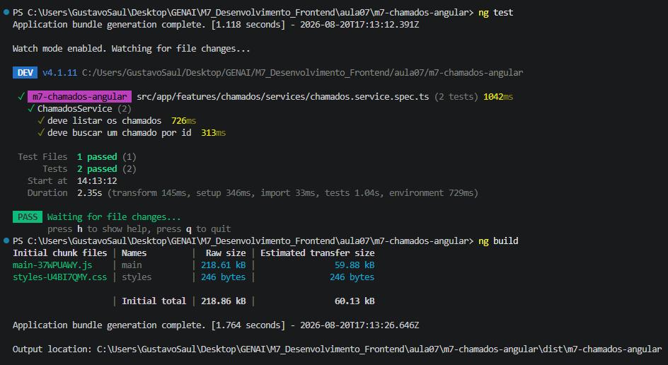

# M7 - Desenvolvimento Frontend

## Aula 6
### Implementação prática com Angular + TypeScript + Testes

## M7 Chamados Angular

## Nome 

Gustavo Rech Saul

## Objetivos da Aula 6

Da arquitetura conceitual da Aula 5 para uma aplicação Angular funcional.

- implementar o sistema de chamados com Angular e TypeScript;
- organizar o projeto por funcionalidade;
- usar componentes standalone, input(), output(), signals e computed();
- usar serviços com injeção de dependência;
- implementar filtros, estados de tela e rotas;
- criar um teste unitário simples com Vitest;
- validar a aplicação com ng test e ng build.

## Validação final do projeto

```
ng test
ng build
```

- Executa os testes automatizados.
```
ng test
```

- Compila a aplicação para produção. Se SSR estiver ativo, a rota dinâmica também precisa estar configurada para o build.
```
ng build
```

---

### Resultado da validação via capturas de execução:



---

## Estrutura final da Aula 6


| Etapa | Componente/Tecnologia |
|---|---|
| 1 | Angular |
| 2 | Modelo Chamado |
| 3 | ChamadosService + DI |
| 4 | ChamadosPage + signals + computed |
| 5 | FiltroChamados + input/output |
| 6 | ListaChamados + @if/@for |
| 7 | ChamadoCard + RouterLink |
| 8 | ChamadoDetalhePage |
| 9 | Angular Router |
| 10 | Vitest |
| 11 | ng build |

## React x Angular - mesma aplicação

| React - Aula 4 | Angular - Aula 6 |
|---|---|
| ✓ `useState()` | ✓ `signal()` / `computed()` |
| ✓ `props` | ✓ `input()` / `output()` |
| ✓ `JSX` | ✓ template HTML |
| ✓ `.map()` | ✓ `@for` |
| ✓ condições JSX | ✓ `@if` |
| ✓ serviço importado | ✓ serviço + DI |
| ✓ React Router | ✓ Angular Router |